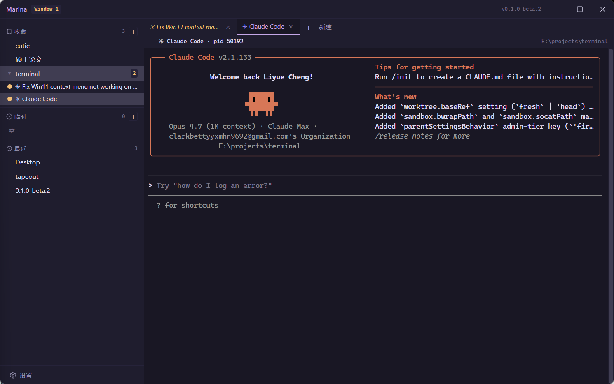

# Marina 试用说明

> 版本:**v0.1.0-beta.3**
> 对象:试用同事
> 期望反馈周期:用一两天,把你日常的活儿挪进来跑跑,记下不爽的地方告诉我

---

## 0. 阅读顺序

这份文档分三块,按这个顺序看:

1. **§1 问题** —— Marina 想解决什么。看完你能判断它是不是为你设计的。
2. **§2 功能** —— 它具体能做什么、怎么装、怎么用、有哪些已知坑。
3. **§3 哲学** —— 为什么是这么设计的。看完你会更理解后面跑场景时为什么"它的某些选择不像传统终端"。

后面 §4-§7 是反馈、bug 报告渠道、预期管理。

---

## 1. 它想解决一个什么问题

### 1.1 一个具体的痛

你大概率遇到过这样的状况:

- 你在 Project A 里跑着 `npm run dev`,在 Project B 里让 Claude Code 改一个 bug,在 Project C 里跑测试。三件事各开一个终端窗口,桌面已经乱了。
- 某个时刻你要重启电脑、要清桌面、要切到另一台显示器,**手贱关错一个窗口**,Claude 跑到一半的对话没了 / dev server 停了 / 测试结果丢了。前功尽弃。
- 你想用 tmux 来防这一手,但你不熟悉 tmux,或者你的同事不熟悉 tmux,或者你的工作流里 90% 是本地、不想为了这 10% 的"防关窗"学一套快捷键。
- 你打开 Windows Terminal 的 tab 列表,看到 "PowerShell"、"PowerShell"、"Bash"、"PowerShell"。**你根本不记得哪个 tab 是哪个项目的**,因为它们都叫 shell 的名字,而不是项目的名字。
- 你想再开第二个终端窗口看一眼旁边的项目,但担心"会不会和原来那个冲突"、"我开的这个会不会把那边的状态搞乱"。

这些不是 Windows Terminal / Tabby / Hyper 做得不好,这是它们的**设计前提**决定的 —— 它们的世界里,终端就是"一个 shell 进程加一块屏幕",你关窗口它就死,你开新的它就是新的,组织维度是 profile / tab,**不是项目**。

### 1.2 AI agent 让这个痛放大了

如果只是 dev server,你重启一下也就几秒钟。但现在你的终端里跑的可能是:

- Claude Code / Codex / Aider 这种长对话 agent —— **关错窗口 = 整段上下文丢失**
- 一个跑了半小时的回归测试 —— **关错窗口 = 重来半小时**
- 一个 docker compose up 起的一堆服务 —— **关错窗口 = 重新连接所有客户端**

AI agent 的工作方式天然就是"一个项目、一条长任务、可能要跑几十分钟",而传统终端的设计前提 "shell 跟着窗口生" 跟这套工作方式是冲突的。

### 1.3 Marina 要解决的就是这个

具体三件事:

1. **关窗不杀任务** —— 任何窗口都只是"任务的查看器",任务跑在后台守护进程里。你关掉所有窗口,任务继续跑,从托盘随时调出来。
2. **按"项目路径"组织,不按"shell 进程"组织** —— 侧栏里你看到的是 `~/code/my-blog`、`~/code/my-app`,不是 `PowerShell #1`、`PowerShell #2`。你点项目,在项目下起任务,不打 `cd`。
3. **多个项目并行、多个 agent 并行** —— 一眼看清每个项目下跑着什么,哪个在等你回应,哪个在干活。

如果上面这些痛你**完全没遇到过**,Marina 可能不是为你设计的(比如你主要在 SSH 远端工作,或者你已经在 tmux 里活得很好)。可以直接跳到 §6 反馈渠道,简短说一句就行。

---

## 2. 软件功能

### 2.1 安装

`release/0.1.0-beta.3/` 下两种安装包,挑一种:

| 包 | 适合谁 | 注意 |
|----|------|------|
| `Marina-Setup-0.1.0-beta.3-x64.exe` | 想正经装到系统、要桌面快捷方式、要右键集成 | 双击装,默认路径就行 |
| `Marina-Portable-0.1.0-beta.3-x64.exe` | 想试一下就删 / 不想动注册表 | 拷到固定位置再双击,**别拷完又移路径** |

**Windows SmartScreen 拦截**:应用没有代码签名(签名证书还没买),第一次启动会蹦出蓝色 "Windows 已保护你的电脑" 对话框。点 **"更多信息" → "仍要运行"** 即可。alpha/beta 阶段预期行为,公测前会签。

**数据目录**:所有配置写在 `%APPDATA%\Marina\`。卸载 / 删 Portable 文件不会动这个目录,想干净卸载请手动删它。

### 2.2 启动后看到什么

第一次开,你会看到:

- 顶部:**自绘标题栏**(没有蓝色系统标题条)
- 左侧:**三栏侧栏** —— 收藏 / 临时 / 最近
- 右侧:**标签区 + xterm 终端区**
- 左下角:**齿轮 = 设置**

收藏是空的,临时和最近也是空的。这是正常的 —— 这工具要你**先告诉它你工作在哪几个路径**,而不是直接给你一个 shell。

**三件事先做**:

1. **把一个常用项目目录加进收藏**:点收藏分类右边的 `+`,选个目录。或者直接从 Explorer 把文件夹**拖**进侧栏。
2. **双击那个路径** → 默认起一个 shell session 在这个路径下。
3. **关掉整个窗口**(点窗口右上角 ×)。任务管理器里看 `Marina.exe` 还在 —— 这是它的核心特性,**关窗 ≠ 关应用**。再单击托盘图标,窗口回来,刚才那个终端还活着。

如果第 3 步终端死了 / 应用没了 —— 这是 bug,告诉我。

### 2.3 几个值得跑一遍的场景

按顺序走完,大概 15-20 分钟。每个场景我标了**关注点**,这是我最想知道你这一步顺不顺。

#### 场景 A:把一个 dev server 跑到后台

1. 收藏一个 Node / Vite / 任何带 dev server 的项目
2. 在这个路径下起一个 shell session
3. 跑 `npm run dev`(或你常用的命令)
4. 关掉这个 Marina 窗口
5. 干别的事,5-10 分钟后从托盘点一下,窗口回来
6. 看 dev server 还活着、日志还在、scrollback 没断

**关注点**:scrollback 有没有断、日志有没有漏、关窗口前最后几秒的输出还在不在。

#### 场景 B:让 Claude Code(或 Codex)在两个项目里同时跑

1. 收藏两个项目目录 A 和 B
2. 分别在 A、B 起一个 Claude Code session(标签区选 "Claude Code" 模板,或者你自定义的)
3. 给两个 agent 各自派活
4. 在侧栏看两个 session 的状态点(🟢 活跃 / 🟡 空闲)
5. 切来切去看哪个在等输入、哪个在跑

**关注点**:同时跑两个 agent 会不会卡、状态点准不准、切换 session 时 xterm 渲染顺不顺。

> 说明:V1 阶段状态点只看"PTY 有没有字节流过",**没法识别 agent 在等你回应**(状态会显示成黄色 "空闲")。这个已经在排队做,不是 bug。

#### 场景 C:右键 Explorer 文件夹打开 Marina

1. 设置 → 系统集成 → 打开 "Explorer 右键集成"
2. 去 Explorer,找一个**没收藏过的**目录
3. 在文件夹空白处右键(Win11 用户:可能要点"显示更多选项"看经典菜单 —— 这是已知问题,见 §2.4)
4. 应该看到 "在 Marina 终端中打开"
5. 点它

**关注点**:Marina 应该在那个路径直接起一个 shell session。这个路径会自动进 "临时" 分类(因为有 session 在跑),关掉 session 后掉到 "最近" 分类。

#### 场景 D:多窗口

1. 托盘右键 → "打开新窗口" → 出现 Window 2
2. 你会看到 **Window 1 已经持有的 session 在 Window 2 里是灰色的、点不开**
3. 点灰色 tab → Marina 会把 Window 1 拉到前面(因为是它持有的)
4. 在 Window 2 起一个新的 session
5. 关掉 Window 1 → Window 2 还在,所有 session 都还在

**关注点**:多窗口之间会不会有 session 错乱、灰色 tab 点击有没有正确聚焦另一个窗口。

#### 场景 E:设置改东西

挑这几个改改:

- 主题切到 Rose Pine Dawn(浅色)、Ubuntu(棕紫)看看渲染
- 按 `Ctrl + 鼠标滚轮` 在终端区调字号
- 字体下拉里换一个等宽字体
- 设置 → 数据 → "导出设置",生成一个 JSON,留作备份

**关注点**:任何设置改完都应该**立即生效不重启**,所有窗口同步变。如果哪个改了没生效或要重启才行,告诉我。

### 2.4 已经知道的几个坑(请预先知道,不算 bug)

这几个我都查过了,要么是上游问题要么是 workaround 已经 ship,**遇到了不用单独报**:

**A. 拖窗口边缘改 TUI 大小,屏幕会糊一下**

跑 Claude Code / vim / btop / less 这类全屏 TUI 时,**拖窗口大小**会让屏幕短时间内出现内容重叠 / 部分被裁。是 Windows ConPTY 上游 bug(微软自家 Windows Terminal 也有,4-5 年没修)。

应急:**按 `Ctrl+L` 强制清屏重画**,或者退出 TUI 重进。

不在 alpha/beta 阶段继续修。详见 `docs/known-issues.md` KI-001。

**B. 新建 Shell 模板,tab 名一开始是 exe 路径**

刚建 Shell session,前几百毫秒 tab 标题可能是 `C:\Windows\System32\WindowsPowerShell\v1.0\powershell.exe` 或 `MINGW64:/c/...`,等 shell 起来后会变回 `"PowerShell"` / `"Bash"`。beta.2 已加过滤兜底,大部分场景下你应该看不到。如果还看到了,记一下场景告诉我。详见 `docs/issues/tit-1-osc-title-shell-startup-garbage.md`。

**C. Win11 新右键菜单看不到 Marina**

Windows 11 默认那个**圆角紧凑的**右键菜单里看不到 "在 Marina 终端中打开",要点 "显示更多选项" 展开经典菜单才能看到。这是因为新菜单要走 IExplorerCommand COM + Sparse Package,还没做。**v0.2 公测前会做**。

详见 `docs/known-issues.md` KI-003。

**D. 不会自动更新**

beta.3 之后我发新版,Marina 不会提示你。请人肉去 https://github.com/Liyue-Cheng/marina/releases 翻。自动更新等代码签名证书买了再做。详见 KI-002。

---

## 3. 设计哲学(为什么这么设计)

§1 给了痛点,§2 给了功能。这一节解释**为什么 Marina 的某些选择和传统终端不一样** —— 看完你就知道某些"看起来怪"的设计不是漏的,是故意的。

如果你只是想试用,可以跳过这一节直接去 §4 反馈。但理解这套哲学会让你试用时的判断更准:某个体验是不是 bug、还是 Marina 故意的取舍。

### 3.1 Session 不是"虚拟终端机",是"在 path 下要做的一件事"

主流终端(iTerm2、Windows Terminal、Hyper、Warp)沿用的是 1970 年代 VT100 物理终端的隐喻:**session = 一台虚拟终端机 = 一个 shell 进程 + 一块屏幕缓冲区**。这个定义把 session 当成**容器**,所以丢了一个 session 是大事,所以 tmux / screen 这一整套工具都在帮用户**护住 session**。

Marina 不这么定义。**Session 是 path 下的一个任务实例**:

- **它的身份**不是"第 3 个 shell",而是"my-blog 下跑着的 dev server"、"my-app 下的 Claude Code"
- **它的归属**是 path,不是窗口、不是 profile
- **它的生命周期**由用户决定何时终止,跟窗口、UI、应用前台/后台无关
- **它是廉价的**:做完一件事就关掉,下次需要再开,不需要珍惜、不需要命名

这跟浏览器 tab 的心智更接近 —— 不是"我有一台机器",而是"我要做一件事,做完关掉"。

**和 tmux 的区别**:tmux 也让 session 不死,但它的 session 还是旧定义里那种长期持有上下文的容器,用户给它取名字(`work`、`server-1`),害怕丢失。**tmux 让 session 不死,Marina 让 session 不重要**。重要的是 path —— path 才是用户会命名、收藏、记忆的东西。

### 3.2 CLI 是 UI 协议,不是命令接口

主流认知里,CLI 是给程序员"输入命令"的接口。

但实际打开一个现代开发者的终端,真正"敲命令"的时间占比正在快速下降。更多的时间在:

- 看 `npm run dev` 的输出
- 跟 `claude code` 对话
- 看 `docker compose up` 的状态行
- 看 `pytest` / `vitest` 的进度
- 回应 `apt` / `rm -i` 的 y/n 提示

这些都不是"输入命令",是**使用文本 UI 应用**。

CLI 工具本质上是用文本(加 ANSI 序列、加 OSC 序列)做渲染的 UI 应用。终端窗口是渲染器,不是 REPL。

**这条洞见对 Marina 的直接含义是反向的** —— 它告诉我们**不该做什么**:

- 不自己实现 prompt(像 Warp 那样)
- 不内嵌 AI 补全
- 不拦截命令做 magic
- 不重做 shell

这些事要么是 shell 的领域(zsh、fish、nushell 在做),要么是 CLI 工具自己的领域(Claude Code 自己呈现对话 UI)。Marina 越过这层界限就会变成"又一个 Warp",而不是"基础设施"。

**Marina 的位置是:所有 CLI UI 应用之下的容器编排器**,不是其中任意一个。xterm.js 已经把"渲染 CLI 这种文本 UI"做到了工业级,Marina 只做上面一层:任务的组织、持久化、状态可见性、跨窗口导航。

### 3.3 从上面两条推出的工程化原则

上面两条是本体论判断。具体落到产品里有四条原则:

1. **Path 是稳定的,Session 是廉价的,UI 是临时的** —— 你应该收藏 path、命名 path,但不应该对单个 session 投入心智,更不应该觉得"关窗口很可怕"。
2. **不让用户输入路径,只让用户点击路径** —— `cd` 是 1971 年的设计,打错就报错或者静默进入错误位置。Marina 把"切换工作位置"重构为"点击一个已存在的 path",彻底绕过文本输入。
3. **用户决策最少化** —— path 在三个分类之间的流转、session 的状态检测、终端 resize…… 能自动的全自动,只在你必须选时才打扰你。
4. **窗口与应用解耦** —— 应用 ≠ 窗口。窗口是临时观察工具,应用是承载所有 session 的守护进程 + 托盘。

### 3.4 一句话归纳

> Path 是项目。Session 是项目里的一件事。Window 是看这件事的临时镜头。CLI 工具自己负责呈现,Marina 负责让它们好好活着、好好被找到。

---

## 4. 真正想听你反馈的几类东西

按优先级:

### P1 · 第一印象 / 直觉障碍

试用前 10 分钟你**卡住的地方**、**找不到的功能**、**以为按 X 会发生 Y 但发生了 Z 的瞬间**。这种最有价值,因为我自己作为作者已经丢失了"第一次用"的视角。

### P2 · 工作流契合度

- 你日常哪些事**愿意挪进 Marina** 来做?
- 哪些事**死活不想挪**?为什么?
- 你现有的工作流里哪一步在 Marina 里更顺 / 更不顺?

### P3 · 真 bug

崩溃、白屏、数据丢失、session 莫名其妙死掉、终端渲染乱码、状态点和实际不符…… 报的时候请尽量带:

- 在做什么(哪个路径、哪个模板、跑什么命令)
- 期望什么
- 实际什么
- 能不能复现

### P4 · UI / 文案 / 美学

主题不好看、字体丑、某个按钮位置怪、某个文字翻得别扭…… 都接受。可以先攒着一起说。

### 不太需要听的

- "你应该加 SSH 支持" / "你应该加 tmux 集成" / "你应该加 AI 补全"
  → 这些是明确**不做**的(理由见 §3.2),不是漏了
- "Warp 有 X,你为什么没有"
  → 我有意识地没做。如果你觉得某个 X 真的非常关键,告诉我"为什么对你而言关键",我会考虑

---

## 5. 反馈渠道

**钉钉:王子维** —— 短反馈、bug 报告、长篇思考都发这里。

**日志在哪**:设置 → 高级 → "打开日志目录" 直接跳到 logs 目录,出 bug 时把当天的日志附上最有用。

---

## 6. 一些预期管理

- **这是 beta**,不是 RC。允许有问题,但不应该频繁炸。如果一天炸两次以上,告诉我立刻修。
- **数据格式可能小变**,但收藏 / 模板这些会保证升级兼容。配置层面破坏性变更我会单独告知。
- **本 beta.3 包只支持 Windows 10/11 x64**。Linux 支持已在 v1.6 路线图(beta 反馈回合内做,Ubuntu 22.04 Tier 1 + Fedora/CentOS Tier 2,详见 [软件定义书 ADR-013](../软件定义书.md#adr-013) 与 [BETA-003](../beta反馈工单库-20260515.md#beta-003--linux-支持方案-a无托盘普通桌面-app));macOS / ARM 仍不在 v1 范围。
- **远端 SSH 不在范围**。在本地 SSH client 起一个 session 是可以的,但 Marina 不会专门为 SSH 体验做优化。

---

谢谢试用。挑刺越狠越好。

— Liyue
